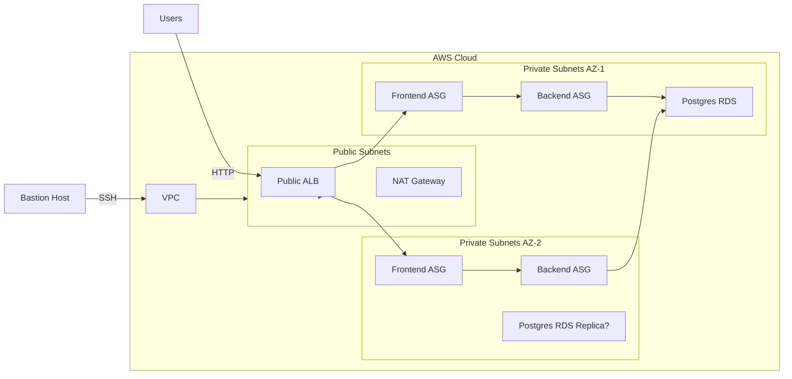

# AWS Terraform 3-Tier Docker App

## Project Summary

This repository implements a three-tier Docker application deployed to AWS using Terraform.
It combines a Node.js frontend, a Go backend, and a PostgreSQL database inside a secure VPC architecture.
The infrastructure is defined with reusable Terraform modules and includes load balancing, auto scaling, bastion access, and Secrets Manager integration.

## Architecture Diagram



## What is included

- `frontend/` - Node.js Express frontend with static SPA serving and API proxying to backend
- `backend/` - Go backend using Gin, Prometheus metrics, and PostgreSQL connectivity
- `terraform-infra/` - Terraform modules and environment configuration for AWS deployment
- `docker-local-deployment/` - Local Docker Compose stack for quick testing
- `terraform-infra/scripts/` - Deployment helper scripts for Terraform and Docker images

## Detailed Implementation

### Frontend

The frontend is a Node.js app that serves static assets and proxies `/api/*` requests to the backend.
It is designed for Docker containerization and deployment behind a public AWS Application Load Balancer.

Key code excerpt from `frontend/server.js`:

```js
const BACKEND_URL = process.env.BACKEND_URL || 'http://localhost:8080';

app.post('/api/goals', async (req, res) => {
  const response = await fetch(`${BACKEND_URL}/goals`, {
    method: 'POST',
    headers: { 'Content-Type': 'application/json' },
    body: JSON.stringify(req.body),
  });
  const data = await response.json();
  res.json(data);
});
```

This pattern ensures the frontend container can call the backend using an environment-configured service URL.

### Backend

The backend is written in Go and exposes goals management APIs.
It connects to PostgreSQL with credentials provided through environment variables and uses Gin for routing.

Key code excerpt from `backend/main.go`:

```go
func createConnection() (*sql.DB, error) {
  connStr := fmt.Sprintf("user=%s password=%s host=%s port=%s dbname=%s sslmode=%s",
    os.Getenv("DB_USERNAME"),
    os.Getenv("DB_PASSWORD"),
    os.Getenv("DB_HOST"),
    os.Getenv("DB_PORT"),
    os.Getenv("DB_NAME"),
    os.Getenv("SSL"),
  )

  db, err := sql.Open("postgres", connStr)
  if err != nil {
    return nil, err
  }
  return db, db.Ping()
}
```

The backend also creates the `goals` table dynamically if it does not exist.

### Infrastructure

Terraform orchestrates the AWS architecture from `terraform-infra/environments/dev/main.tf`.
The deployment creates:

- VPC with public and private subnets
- NAT gateway for outbound internet access from private tiers
- Public and internal ALBs
- Auto Scaling Groups for frontend and backend nodes
- RDS PostgreSQL instance for persistent storage
- Secrets Manager secrets for secure credential delivery
- Bastion host for SSH access to private resources

A central Terraform module structure is used:

- `modules/vpc` - builds the VPC, subnets, route tables, and NAT gateways
- `modules/security-groups` - defines security group rules
- `modules/alb` - provisions both public and internal application load balancers
- `modules/frontend-asg` and `modules/backend-asg` - deploy instances into private subnets
- `modules/rds` - provisions PostgreSQL
- `modules/secrets` - stores database credentials securely
- `modules/iam` - creates instance profiles for EC2

Example Terraform module usage from `terraform-infra/environments/dev/main.tf`:

```hcl
module "rds" {
  source = "../../modules/rds"
  environment = var.environment
  project = var.project
  subnet_ids = module.vpc.database_subnet_ids
  security_group_id = module.security_groups.rds_sg_id
  db_username = var.db_username
  db_password = random_password.db_password.result
}
```

This design keeps the environment configuration clean and reusable.

## Deployment Workflow

### Local Testing

Before pushing to AWS, the application can be tested locally using Docker Compose:

```bash
cd docker-local-deployment
docker-compose up --build
```

This starts the frontend, backend, and database containers together.

### Build and Push Docker Images

Docker images are built from the `frontend/` and `backend/` folders and pushed to Docker Hub.
Use the helper script:

```bash
cd terraform-infra/scripts
./build-and-push.sh your-dockerhub-username
```

This script tags and pushes both images and optionally triggers AWS Auto Scaling Group refresh for deployed infrastructure.

### Terraform Deployment

The Terraform deployment script enforces prerequisites and a controlled apply flow.

```bash
cd terraform-infra/scripts
./deploy.sh
```

The script performs:
- `terraform init`
- `terraform validate`
- `terraform plan`
- `terraform apply`

It also checks for `terraform.tfvars` and asks you to confirm before applying.

## Screenshot Examples

### Deployment


## Challenges and Solutions

### 1. Secure database credentials

**Challenge:** The backend requires database credentials, but those must not be hard-coded.

**Solution:** Terraform generates the credentials using `random_password` and stores them in AWS Secrets Manager.
The backend ASG then retrieves the secret at runtime through environment configuration.

### 2. Private backend and public frontend separation

**Challenge:** The frontend needs to be publicly reachable while the backend should remain private.

**Solution:** A public ALB exposes the frontend tier, and an internal ALB routes requests to backend instances.
The configuration in `terraform-infra/environments/dev/main.tf` sets `internal = true` for the internal ALB, keeping the backend isolated.

### 3. Infrastructure as code with modular reuse

**Challenge:** Keeping Terraform maintainable across multi-tier architecture.

**Solution:** The repository uses small Terraform modules for each AWS component.
This modular approach improves readability, reduces duplication, and makes the stack easier to extend.

### 4. Local and remote deployment parity

**Challenge:** Ensuring the same code runs locally and on AWS.

**Solution:** The application is containerized in `frontend/` and `backend/` with consistent environment variables, allowing local `docker-compose` tests to mirror cloud deployment behavior.

## Key Files and What They Do

- `frontend/server.js` - frontend proxy server and static app route handling
- `backend/main.go` - API endpoints, PostgreSQL connectivity, and metrics registration
- `terraform-infra/environments/dev/main.tf` - environment-specific infrastructure wiring
- `terraform-infra/modules/vpc/main.tf` - VPC and subnet topology
- `terraform-infra/scripts/build-and-push.sh` - Docker build/push automation
- `terraform-infra/scripts/deploy.sh` - Terraform deployment orchestration

## How to Use This Repository

1. Clone the repository
2. Configure `terraform-infra/environments/dev/terraform.tfvars`
3. Build and push Docker images with `terraform-infra/scripts/build-and-push.sh`
4. Deploy infrastructure with `terraform-infra/scripts/deploy.sh`
5. Access the public frontend through the ALB DNS name output by Terraform

## Future Improvements

- Add a true multi-AZ RDS deployment with read replica support
- Add CloudWatch logging and alerts for application and infrastructure events
- Add GitHub Actions for automated Terraform plan and Docker image CI/CD

## Conclusion

This project demonstrates a practical AWS deployment pattern for a containerized three-tier application.
It combines Terraform infrastructure as code, Docker image automation, secure secret management, and a clean separation of public and private tiers.

With the provided scripts, the stack is easy to deploy, test, and maintain.
